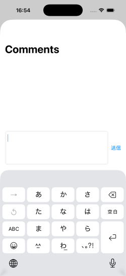
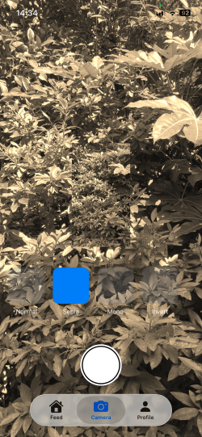

# SwiftUI Realtime SNS

An iOS social networking application built with **SwiftUI**, **Firebase**, **AVFoundation**, and **Metal**.

This project combines a real-time social feed with a custom Metal-powered camera. Users can capture photos and videos with GPU-accelerated filters and share them through the application.

---
## Screenshots

<p float="left">
  
  
  
</p>
<p align="left">
  
  
  
</p>

## Demo
A demonstration video will be added in a future update.

(Currently available as a MOV recording in the repository.)

---

## ✨ Features

### 📷 Camera

- Real-time camera preview
- Metal-based GPU rendering
- Normal / Mono / Sepia / Invert filters
- Adjustable filter intensity
- Front / Back camera switching
- Photo capture
- Filtered photo saving
- Filtered video recording
- Save to Photo Library
- REC indicator
- Recording completion toast

### 📰 Feed

- Firebase Firestore integration
- Real-time feed
- Image posts

### 👤 Profile

- Firebase Authentication
- User profile
- Profile editing (In Progress)

---

## 🛠 Tech Stack

- Swift
- SwiftUI
- Firebase Authentication
- Cloud Firestore
- Firebase Storage
- AVFoundation
- Metal
- MTKView
- AVAssetWriter
- CoreVideo

---

## 🏗 Architecture

```text
SwiftUI

├── Feed
│      │
│      └── Firebase Firestore
│
├── Camera
│      │
│      ├── AVFoundation
│      ├── Metal
│      ├── Renderer
│      ├── MetalFilterManager
│      └── VideoRecorder
│
└── Profile
       │
       ├── Firebase Auth
       └── Firestore
```

---

## 📸 Camera Pipeline

```text
Camera

↓

CMSampleBuffer

↓

Renderer

↓

Metal Filter

↓

Preview

↓

Photo Save

↓

VideoRecorder (AVAssetWriter)

↓

Photo Library
```

---

## Firestore Structure

```
posts
 └── postId
      ├── imageUrl
      ├── imagePath
      ├── userId
      ├── userName
      ├── likedBy
      ├── commentCount
      ├── createdAt
      └── comments
           └── commentId
                ├── text
                ├── userId
                ├── userName
                └── createdAt
```
  
## 🚀 Future Improvements

- User profile editing
- Like & Comment
- Follow system
- More Metal filters
- Performance optimization

---

## 📄 License

Takayuki Sakamoto  
https://github.com/taka-sakamoto  
