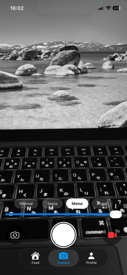
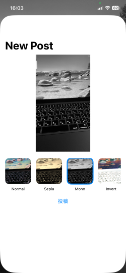
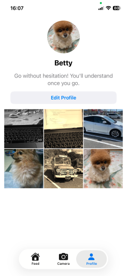

# SwiftUI Realtime SNS

## Overview

SwiftUI Realtime SNS is an iOS social networking application built with SwiftUI, Metal, and Firebase.

The app features real-time Metal camera filters, photo and video capture, and seamless integration with Firebase Authentication, Cloud Firestore, and Firebase Storage. Users can capture photos with live filters, adjust filters before posting, upload images to the cloud, and interact with posts through likes and profile management.

The project follows the MVVM architecture and demonstrates modern iOS development using Swift Concurrency (async/await), Firebase services, Metal image processing, and efficient image loading with Kingfisher.

This project was developed as a portfolio application to showcase practical iOS development skills, combining camera technology, image processing, cloud services, and responsive SwiftUI user interfaces.

---

## ✨ Features

### Authentication
- Anonymous sign-in with Firebase Authentication

### Feed

- View posts in real time using Cloud Firestore
- Like posts
- Double-tap to like
- Full-screen image viewer
- Pinch-to-zoom image support
- Optimized image loading with Kingfisher

### Camera

- Real-time Metal camera preview
- Sepia, Mono, and Invert filters
- Adjustable filter intensity
- Front and rear camera switching
- Filtered photo capture
- Filtered video recording
- Save captured media to the Photos library

### Posting

- Upload photos from the Photo Library
- Direct camera-to-post workflow
- Edit filters before uploading
- Automatic image resizing (720 px)
- JPEG compression for optimized uploads
- Upload images to Firebase Storage
- Store post metadata in Cloud Firestore

### Profile

- Edit display name and bio
- Upload and update profile images
- View your own posts
- Cached profile images with Kingfisher

### Architecture

- MVVM architecture
- Swift Concurrency (async/await)
- Firebase Authentication
- Cloud Firestore
- Firebase Storage
- Metal
- AVFoundation
- Kingfisher

---

## Screenshots

<p float="left">
  
  
</p>
<p align="left">
  
  
</p>
<p float="left">
  
  
</p>

 ---
 
## Demo
A demonstration video will be added in a future update.

(Currently available as a MOV recording in the repository.)

---

## 🛠 Tech Stack

- Swift
- SwiftUI
- Firebase Authentication
- Cloud Firestore
- Firebase Storage
- AVFoundation
- Metal
- MTKView
- AVAssetWriter
- CoreVideo

---

## 🏗 Architecture

```text
SwiftUI

├── Feed
│      │
│      └── Firebase Firestore
│
├── Camera
│      │
│      ├── AVFoundation
│      ├── Metal
│      ├── Renderer
│      ├── MetalFilterManager
│      └── VideoRecorder
│
└── Profile
       │
       ├── Firebase Auth
       └── Firestore
```

---

## 📸 Camera Pipeline

```text
Camera

↓

CMSampleBuffer

↓

Renderer

↓

Metal Filter

↓

Preview

↓

Photo Save

↓

VideoRecorder (AVAssetWriter)

↓

Photo Library
```

---

## Firestore Structure

```
posts
 └── postId
      ├── imageUrl
      ├── imagePath
      ├── userId
      ├── userName
      ├── likedBy
      ├── commentCount
      ├── createdAt
      └── comments
           └── commentId
                ├── text
                ├── userId
                ├── userName
                └── createdAt
```
  
## 🚀 Future Improvements

- User profile editing
- Like & Comment
- Follow system
- More Metal filters
- Performance optimization

---

## 📄 License

Takayuki Sakamoto  
https://github.com/taka-sakamoto  
