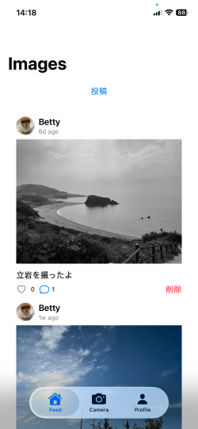
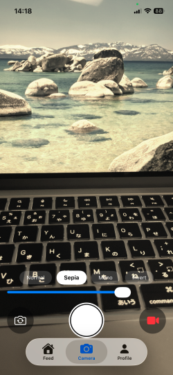
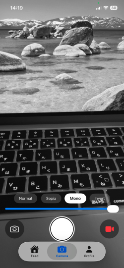
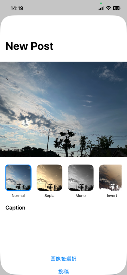
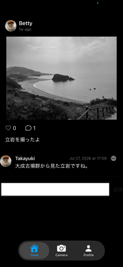
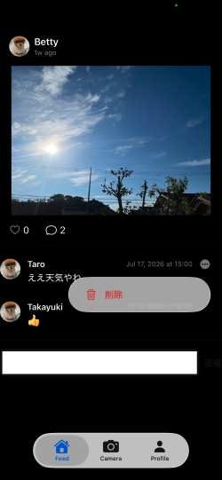
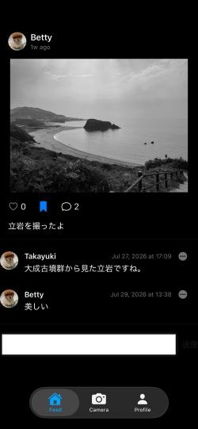

# SwiftUI Realtime SNS

<p align="center">

</p>

## Overview

Overview

SwiftUI Realtime SNS is an iOS social networking application built with SwiftUI, Metal, and Firebase.

The app features real-time Metal camera filters, photo and video capture, post creation, likes, comments, bookmarks (saved posts), user profiles, and seamless integration with Firebase Authentication, Cloud Firestore, and Firebase Storage.

The project follows the MVVM architecture and demonstrates modern iOS development using Swift Concurrency (async/await), Firebase services, Metal image processing, and efficient image loading with Kingfisher.

The project follows the MVVM architecture and focuses on building a modern, real-time social networking experience with clean and maintainable SwiftUI code.

---

## ✨ Features

✨ Features

- 📷 Real-time Metal camera filters
- 🖼 Photo capture and library upload
- 📝 Create and delete posts
- ❤️ Like and unlike posts
- 💬 Comment on posts
- 🔖 Save (Bookmark) posts
- 📂 View saved posts from your profile
- 👤 Edit profile (display name, bio, profile image)
- 🖼 Full-screen image viewer
- ⚡ Real-time Firestore updates
- 🔐 Firebase Anonymous Authentication
- ☁️ Firebase Storage image uploads

---

## UI Architecture

```
PostDetailView
├── Header
├── Image
├── Action Bar
├── Caption
├── Comments
│   └── CommentRow
└── Comment Input
```

---

## Screenshots
|Feed|Camera|Filter|
|---|---|---|
||||

|New Post|Profile|
|---|---|
|||

|Post Detail|Comment Menu|Saved Posts|
|---|---|---|
||||

 ---
 
## Demo

https://github.com/user-attachments/assets/2ebd2a13-9ac1-4022-93e1-f3485ed064e4

---

## 🛠 Tech Stack

- Swift
- SwiftUI
- Firebase Authentication
- Cloud Firestore
- Firebase Storage
- AVFoundation
- Metal
- MTKView
- AVAssetWriter
- CoreVideo
- Kingfisher

---

## 🏗 Architecture

```text
SwiftUI
   ↓
   MVVM
   ↓
Firebase
├── Auth
├── Firestore
└── Storage
   ↓
Metal
```

---

## 📸 Camera Pipeline

```text
Camera

↓

CMSampleBuffer

↓

Renderer

↓

Metal Filter

↓

Preview

↓

Photo Save

↓

VideoRecorder (AVAssetWriter)

↓

Photo Library
```

---

## Firestore Structure

```
posts
 └── postId
      ├── imageUrl
      ├── imagePath
      ├── userId
      ├── userName
      ├── likedBy
      ├── commentCount
      ├── createdAt
      └── comments
           └── commentId
                ├── text
                ├── userId
                ├── userName
                ├── profileImageURL
                └── createdAt
```
  
## 🚀 Future Improvements

- Push notifications
- Follow system
- User search
- Notifications

---

## 📄 License

Takayuki Sakamoto  
https://github.com/taka-sakamoto  
