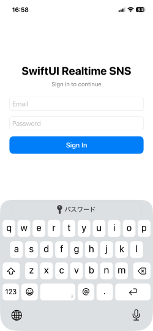

# SwiftUI Realtime SNS

<p align="center">

</p>

## Overview

SwiftUI Realtime SNS is an iOS social networking application built with SwiftUI, Metal, and Firebase.

The app features real-time Metal camera filters, photo and video capture, post creation, likes, comments, bookmarks (saved posts), user profiles, and a follow system.

The project integrates Firebase Authentication, Cloud Firestore, and Firebase Storage, and demonstrates modern iOS development using Swift Concurrency (`async/await`), Metal image processing, and efficient image loading with Kingfisher.

The project follows the MVVM architecture and focuses on building a modern, real-time social networking experience with clean and maintainable SwiftUI code.

---

## ✨ Features

- 📷 Real-time Metal camera filters
- 🖼 Photo capture and library upload
- 📝 Create and delete posts
- ❤️ Like and unlike posts
- 💬 Comment on posts
- 🔖 Save (Bookmark) posts
- 📂 View saved posts from profile
- 👤 Edit profile
  - Display name
  - Bio
  - Profile image
- 👥 Follow / Unfollow users
- 👤 View Followers
- 👥 View Following
- 🤝 Follow Back
- 🔐 Firebase Authentication
  - Email / Password authentication
  - Login / Logout
  - Authentication state management
- 🖼 Full-screen image viewer
- ⚡ Real-time Firestore updates
- ☁️ Firebase Storage image uploads

---

## 🔐 Authentication

The application uses Firebase Authentication with Email / Password.

Authentication state is managed by `AuthViewModel`.

```
App Launch
    ↓
AuthViewModel
    ↓
Authentication State
    ├── Not Logged In
    │      ↓
    │   LoginView
    │
    └── Logged In
           ↓
       MainTabView
```

When a user logs in for the first time, a profile document is created in Firestore:

users/{uid}

On subsequent logins, the existing user profile is retrieved.

The application also distinguishes between the logged-in user's own profile and other users' profiles. Logout is available only on the current user's profile.

---

## 👥 Follow System

The follow system allows users to follow and unfollow other users.

Implemented features include:

Follow
Unfollow
Followers list
Following list
Follow Back
Following state
Follower count
Following count

The follow relationship is stored under each user's Firestore document.

```
users
 └── userId
      ├── followers
      │    └── userId
      │
      └── following
           └── userId
```

The follow system has been tested using multiple Firebase Authentication users.

---

## UI Architecture

```
UI Architecture
MainTabView
├── Feed
│   ├── PostRow
│   └── PostDetailView
│       ├── Header
│       ├── Image
│       ├── Action Bar
│       ├── Caption
│       ├── Comments
│       │   └── CommentRow
│       └── Comment Input
│
├── Camera
│   ├── Camera Preview
│   ├── Metal Filter
│   └── Capture
│
├── Saved Posts
│   └── PostDetailView
│
└── Profile
    ├── Profile Header
    ├── Follow Button
    ├── Followers
    ├── Following
    └── User Posts
```

---

## Screenshots
|Feed|Camera|Filter|
|---|---|---|
||||

|New Post|Profile|Login|
|---|---|---|
||||

|Post Detail|Comment Menu|Saved Posts|
|---|---|---|
||||

 ---
 
## Demo

https://github.com/user-attachments/assets/2ebd2a13-9ac1-4022-93e1-f3485ed064e4

---

## 🛠 Tech Stack

- Swift
- SwiftUI
- Firebase Authentication
- Cloud Firestore
- Firebase Storage
- Swift Concurrency
- AVFoundation
- Metal
- MTKView
- AVAssetWriter
- CoreVideo
- Kingfisher

---

## 🏗 Architecture

The application follows the **MVVM architecture**.

```
SwiftUI Views
      ↓
ViewModels
      ↓
Repositories
      ↓
Firebase
├── Authentication
├── Firestore
└── Storage

Camera
   ↓
AVFoundation
   ↓
CMSampleBuffer
   ↓
Metal
   ↓
Renderer
   ↓
SwiftUI
```

ViewModels are responsible for UI state and application logic, while repositories handle Firebase data access.

---

## 📸 Camera Pipeline

```
Camera
   ↓
CMSampleBuffer
   ↓
Renderer
   ↓
Metal Filter
   ↓
Preview
   ↓
Photo Save
   ↓
VideoRecorder
   ↓
AVAssetWriter
   ↓
Photo Library

The camera pipeline uses Metal for real-time image processing and AVFoundation for camera capture and video recording.
```

---

## 🔥 Firestore Structure

### Users
```
users
 └── userId
      ├── followers
      │    └── userId
      │
      ├── following
      │    └── userId
      │
      └── savedPosts
           └── postId
```
### Posts
```
posts
 └── postId
      └── comments
           └── commentId
```

---

## 🧩 Key Components

### Authentication
- `AuthViewModel`
- `LoginView`
  
### Feed / Posts
- `ImageListViewModel`
- `PostRow`
- `PostDetailView`
- `PostImageView`
  
### Profile
- `ProfileViewModel`
- Profile editing
- Profile image management
- User post listing
  
### Follow
- `FollowButton`
- `FollowListViewModel`
- `FollowersView`
- `FollowingView`
- `UserRow`
  
### Comments
- `CommentRow`
- Comment creation
- Comment deletion
- Profile image display

---
  
## 🚀 Future Improvements

- 🔔 Push notifications
- 🔎 User search
- 📰 Feed filtering by followed users
- 🔔 Follow / Like / Comment notifications
- 💬 Additional social features

---

## 📄 License

Takayuki Sakamoto

GitHub: https://github.com/taka-sakamoto

